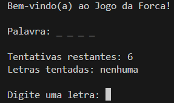
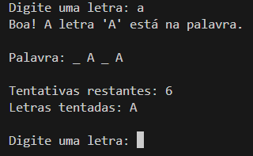
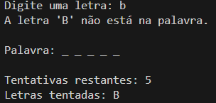
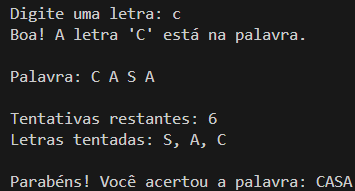
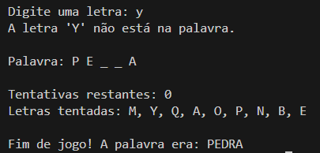

# Jogo-da-Forca
Este é um simples (extremamente simples) [jogo da forca](https://pt.wikipedia.org/wiki/Jogo_da_forca) feito em Python. 
O jogo consiste em adivinhar uma palavra cujas letras são desconhecidas. Pode-se chutar até 6 letras erradas, com o jogo acabando se:
1. O jogador zera seus chutes
2. O jogador acerta a palavra
Se o chute estiver correto, a letra escolhida será substituída nos locais apropriados, não diminuindo as tentativas restantes do jogador. Do contrário, o número de tentativa simplesmente diminui.

---

## Diretórios:
jogo-da-forca <br />
├── README.md <br />
├── LICENSE <br />
├── assets <br />
│   ├── jogo_ganho.png <br />
│   ├── jogo_perdido.png <br />
│   ├── tela_inicial <br />
│   ├── tentativa_certa.png <br />
│   └── tentativa_falha.png <br />
├── main.py <br />
└── words.txt <br />

- ```README.md```: arquivo readme.
- ```LICENSE```: MIT license.
- ```assets```: pasta onde arquivos PNGs estão armazenados.
- ```main.py```: jogo da forca programa.
- ```words.txt```: arquivo de texto que armazena as palavras do jogo.

---

## Jogando o Jogo da Forca

No começo, nós temos uma palavra escolhida aleatoriamente na lista em ```words.txt```, com todas as suas letras ocultas. Nos é pedido para digitarmos uma letra:



---

Após digitarmos a letra, o programa nos dirá se a letra está ou não está na palavra. Caso esteja, será mostrado:



Do contrário:



---

Continuando o jogo, o jogador poderá, de maneira vitoriosa, acertar a palavra:



Ou, infelizmente, perder o jogo:




---

## O que é necessário para jogar
- Para jogar o jogo da forca, é necessário que você tenha alguma versão de Python instalada no seu computador (Python 3.9 ou superior). Caso já tenha instalado, rode `python --version` no terminal para checar. Caso não seja a versão desejada, instale Python por aqui: https://www.python.org/downloads/
- É extremamente necessário ter o arquivo ```words.txt``` no mesmo script que o ```main.py```.
- Instalado o Python, basta abrir o arquivo ```main.py``` (lembrando: o arquivo ```words.txt``` precisa estar no mesmo script), e rodar 
`python main.py`. Divirta-se!
- Não é preciso de nenhuma dependência externa para executar o programa.
---

## Licence
This project is licensed under the MIT license. For more information, see the [License](LICENSE) file.
